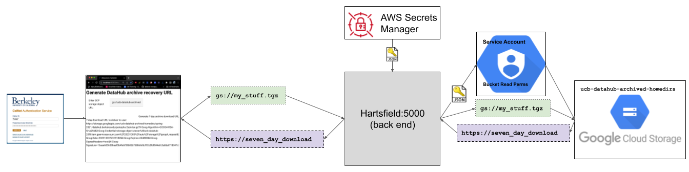

# Hartsfield

Hartsfield humbly supports UC Berkeley's DataHub.


## Installation

* Install Python 3
* Create your virtual environment (venv)
* Install dependencies

```
pip3 install -r requirements.txt [--upgrade]
```


### Create local configurations

If you plan to use any resources outside localhost, put your configurations in a separately encrypted area:

```
mkdir /Volumes/XYZ/hartsfield_config
export HARTSFIELD_LOCAL_CONFIGS=/Volumes/XYZ/hartsfield_config
```

## To run this locally:

### Install a python 3.11 venv in the project directory, activate it, and install requirements:

```
python3.11 -m venv ./venv
source ./venv/bin/activate
pip install -r requirements.txt
```

### Install npm (the Node.js package manager), adjust the version, install the project dependencies, and do the "audit fix" if it complains that you should do so:

https://docs.npmjs.com/downloading-and-installing-node-js-and-npm

```
npm install -g npm@9.8.1
npm install
npm audit fix
```

### Run one terminal session for the python back end...

```
source venv/bin/activate
source .env.development
export HARTSFIELD_LOCAL_CONFIGS=/Volumes/XYZ/hartsfield_config
export HARTSFIELD_ENV=development
venv/bin/python application.py
```
### ...and another terminal session for the Node.js front end:
```
source .env.development
export HARTSFIELD_LOCAL_CONFIGS=/Volumes/XYZ/hartsfield_config
export HARTSFIELD_ENV=development
npm run serve-vue
```


## A diagram of the intended function of the application:


